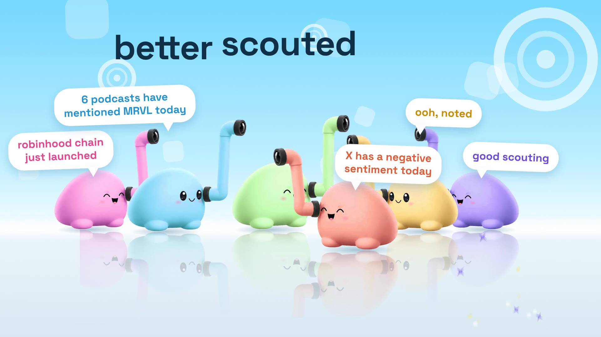

# Scouter launch film

A 32 second, 1080p24 launch film for Scouter starring the periscope blob, built in code like the showreel next door.

**Watch:** [`dist/scouter.mp4`](dist/scouter.mp4)



## The story

Scouter's mascot lives alone in a quiet pastel world and watches the markets through its periscope. The lens looks at a crypto market, then a podcast, then the stock market. Peri gets pinged, pushes in, scouts all three, and then five friends drop in with what they found: "robinhood chain just launched", "6 podcasts have mentioned MRVL today", "X has a negative sentiment today". The line is "better scouted together", and it ends on a waitlist screen and the logo lockup, with the same note motif as the opening.

| Time | Beat |
| --- | --- |
| 0.0 | Wordmark spells itself, the mint ball in the o grows into a lens |
| 1.6 | Lens montage: crypto (4.0 cut), podcast (6.0 cut), stock market |
| 8.0 | Peri drops in, the lens floats off as an orb and pings |
| 10.6 | Camera pushes in, cards appear in Peri's line of sight, "scout all 3" and confetti |
| 17.2 | Dolly into the face, eyes dart, check badge, joy |
| 21.0 | Pull back, five friends arrive and say their lines, tagline |
| 27.5 | Waitlist screen, iris closes on the logo |

The market lines and tickers are placeholder copy for illustration. The end card says so.

## How it works

* `tools/prep_sprites.py` cuts the supplied character art into a body, a stretchable periscope and recolored friends. The face is removed from the art and redrawn as vectors, so the eyes can blink, dart and stay sharp in close ups.
* `src/` is the whole animation. Every frame is a pure function of time (`core.js` helpers, `peri.js` character rig, `scenes.js` the crypto, podcast and stock worlds, `ui.js` cards, bubbles and phone, `film.js` the timeline and camera).
* `audio/synth.py` synthesizes the soundtrack on the same 120 BPM grid, with effects placed on the on screen beats.
* `render.mjs` renders every frame in headless Chromium with temporal motion blur and encodes with ffmpeg.

## Rebuild

```sh
pip install numpy scipy pillow opencv-python-headless
python3 scouter/tools/prep_sprites.py      # only if the art changes
python3 scouter/audio/synth.py             # scouter/dist/soundtrack.wav
node scouter/render.mjs                    # scouter/dist/scouter.mp4 (needs playwright + ffmpeg)
node scouter/render.mjs --stills 0,300     # single frames to scouter/dist/stills
```

To preview with sound, serve the repo root (`npx serve .`) and open `scouter/index.html`.
